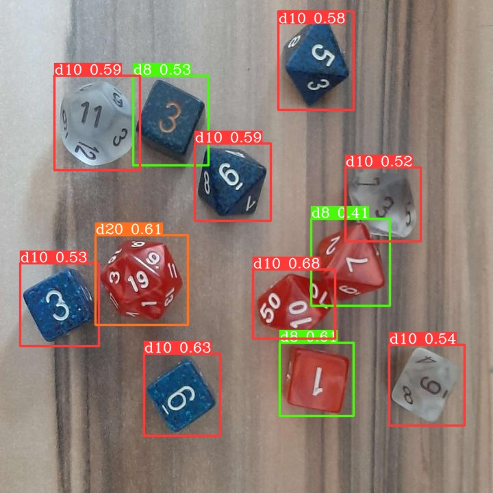
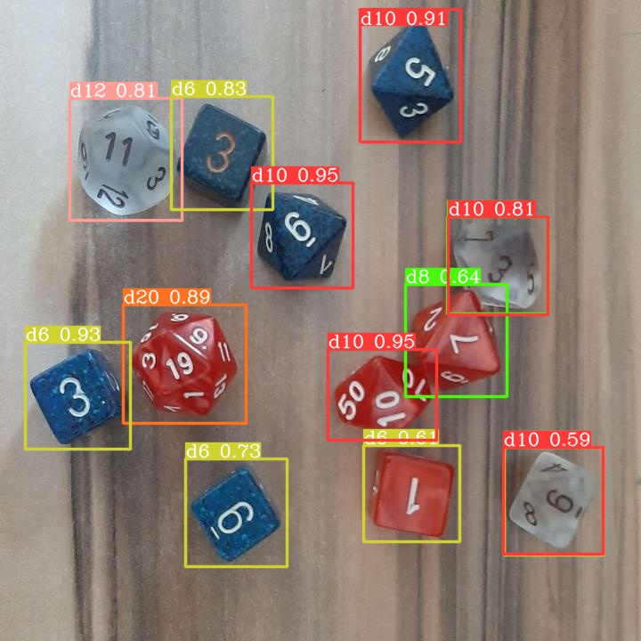
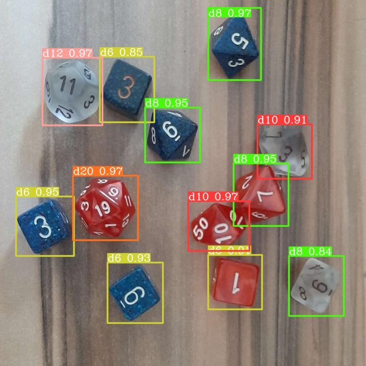

# YOLOv6 Dice detection

A simple practice project for seeing how the quality of YOLOv6-N neural networks is impacted by dataset size. The neural network was trained for detecting different dice in a standard 7 dice set. 

## Training Methodology

The dataset, annotated in [Roboflow](https://roboflow.com/), started with 50 pictures (80% train, 10% test, 10% validate) and was expended twice with aproximately 50 pictures (90% train, 5% test, 5% validate), for a total of 148 pictures. All 3 networks were validated on the latest batches validation images and saved to [the assets folder](./assets)

### Validation results

## Testing with a camera

The 150 picture dataset network is testable by running [main.py](./main.py) (camera required). The network itself is stored in [the data folder](./data) using ONNX. [The object detector class](./detector.py) was made implementing parts of [Ibai Gorordo's](https://github.com/ibaiGorordo) [ONNX-YOLOv6-Object-Detection](https://github.com/ibaiGorordo/ONNX-YOLOv6-Object-Detection) project.

### Thoughts

The preformance scales incredibly well with the size of the dataset provided. The current network works well with pictures but it still has problems with cameras, or at the very least my camera that is old, very noisy and very blurry. Example video test_dice_ai.mp4 shows some problems the AI encounters with household objects but it does recognize all dice as dice.
